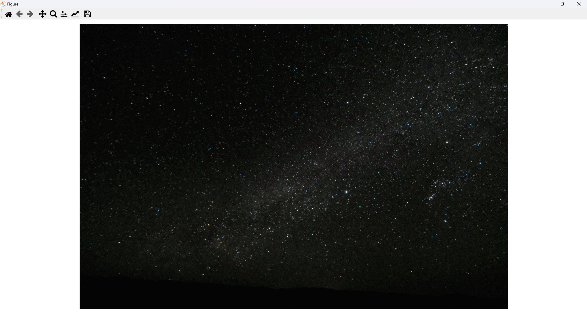
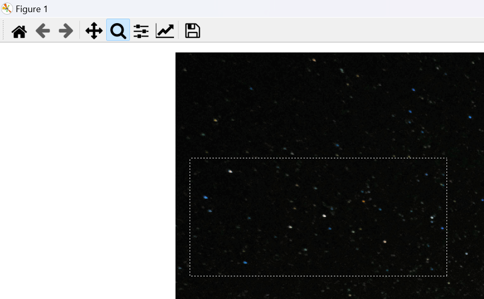
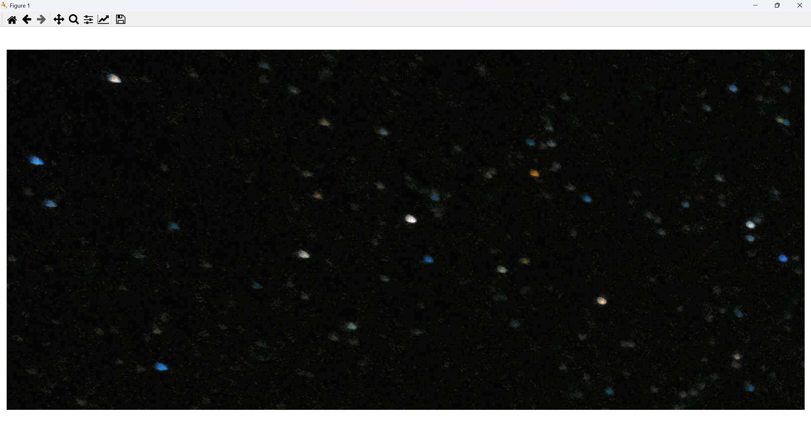
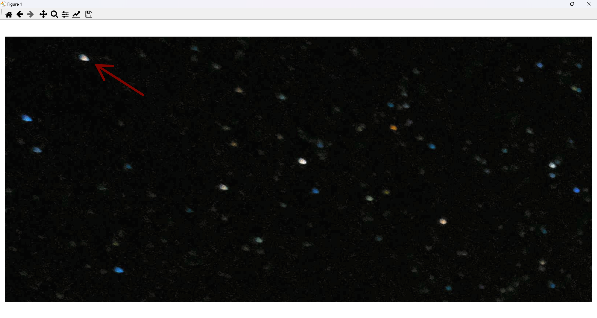
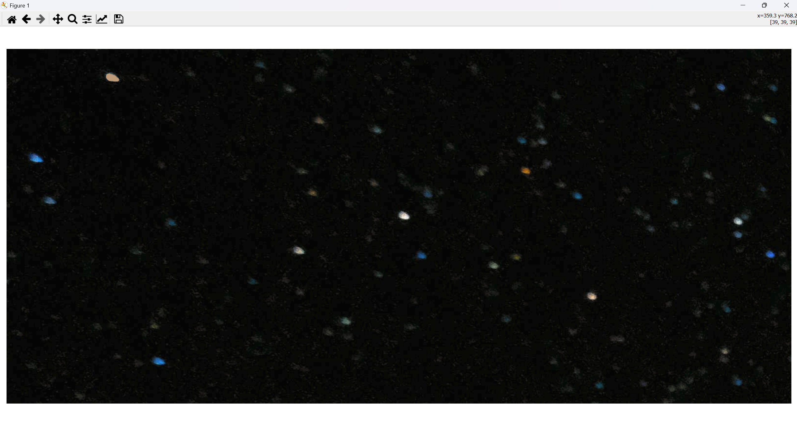

# ImageAnnotator
A Python tool for annotating images with instance segmentation masks. This script allows users to draw and save masks with unique colors for each instance, making it useful for tasks such as segmenting glistening effects in AS-OCT images or other similar image segmentation projects.

## Features
- Annotate images by drawing on them with unique colors for each instance.
- Supports undoing the last drawing action.
- Optionally applies CLAHE for contrast enhancement.
- Saves the generated masks in the specified directory.

## Installation

1. Clone the repository:
    ```sh
    git clone https://github.com/yourusername/ImageAnnotator.git
    ```

2. Install the required dependencies:
    ```sh
    cd ImageAnnotator
    pip install opencv-python-headless numpy matplotlib
    ```

## Usage
1. Prepare your images and specify the paths in the script.
    ```python
    annotator = ImageAnnotator(
        image_path="images\\example.png",
        mask_save_path="masks\\example.png"
    )
    ```
2. Optional: Customize Parameters:

    - `paint_button`: Mouse button for drawing (default: 3 for right mouse button).
    - `circle_size`: Size of the circle to draw (default: 3).
    - `redo_key`: Key to undo the last drawing action (default: 'z').
    - `max_history_size`: Max number of images in the undo history (default: 15).
    - `apply_clahe`: Apply CLAHE for contrast enhancement (default: True).
    - `brightness_threshold`: Minimum brightness for drawing colors (default: 80).

3. Run the script:
    ```sh
    python image_annotator.py
    ```
   This will display the image specified in `image_path`:
   
    <p align="center">
      
    </p>
       
4. Use matplotlib's window functionalities like zoom to make precise annotations:

   <p align="center">
      
    </p>
    <p align="center">
      
    </p>

5. Draw with the mouse button set in `paint_button` (right-click by default):

    <p align="center">
      
    </p>
    <p align="center">
      
    </p>

6. Close the window when finished. The final mask will be saved to the path specified in `mask_save_path`:

   <p align="center">
      
    </p>

## References

1. Image by Francesco Ungaro from Pexels: [Starry Sky](https://www.pexels.com/photo/starry-sky-998641/)
